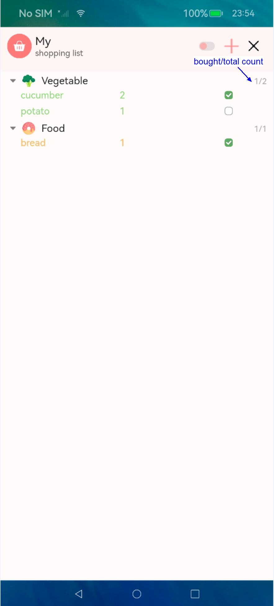

#  MyList Application

## Description

MyList is application to list the items in case forgetting to buy or to take.

### Functions

#### Main functions

Add item:

Edit item：

Delete items:

#### other functions:

Two themes available to choose: light and dark:

Showing bought items and total items:

Hide items:

## Directories
~~~
MyList
├── entry                                
│   └── src
│       └── main
│           └── ets     
|               ├── entryability          # entry ability
│               ├── model                 # database operations
│               ├── pages                 # pages of the app
│                   ├── components        # components which is used by pages
│                   ├── Constants         # constatns which used in app
│                   └── index             # index page
│           └── resources                 # resources directory
└──
~~~